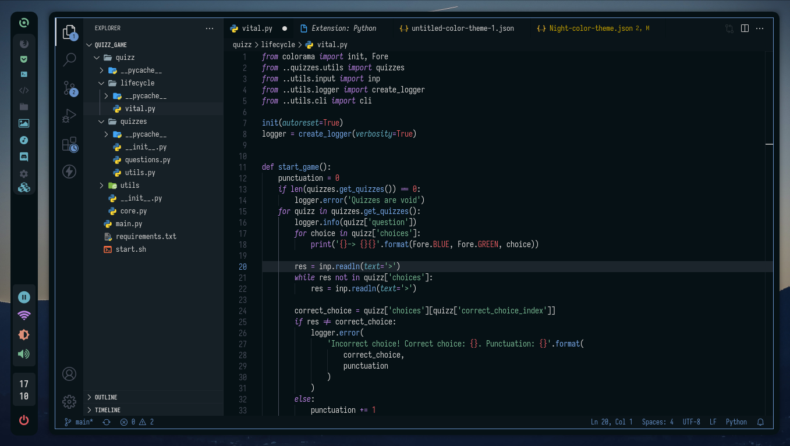

# Night

This is the night theme for vscode

> A theme based in the colorscheme showed in the rxyhn's dotfiles



## Installation

1. Clone the repository

```sh
git clone https://github.com/NightCS/vscode night-vscode
```

2. Go to vscode
3. Open extensions
4. Click at three dots in the sidebar at right top
5. Click in 'Install from VSIX'
6. Search for `night/night-0.0.1.vsix` and select it
7. Select `Night` colorscheme for themes selector